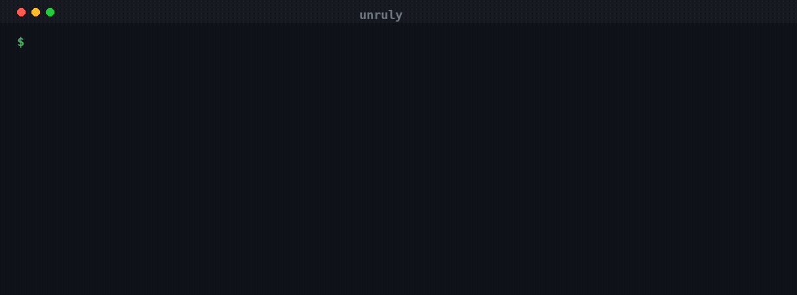
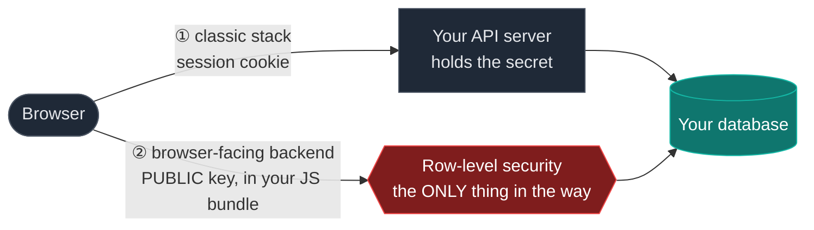
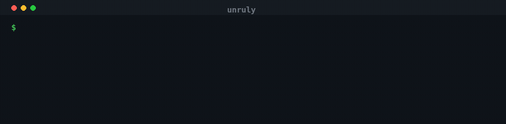
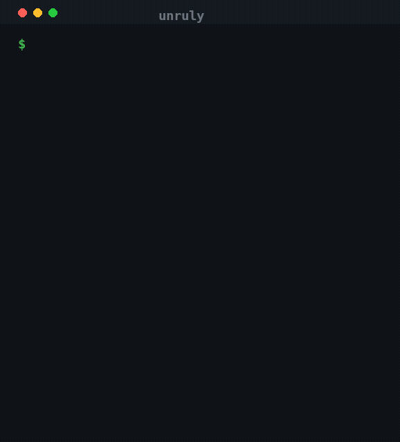

<div align="center">

# unruly

**Security scanner for backend-as-a-service databases — Supabase, Firebase, Neon, PocketBase.**

A BaaS puts your database on the internet behind one public key and a row-level
security policy. Give unruly a URL: it finds the key in your own bundle, proves
what that key reaches — with the rows — and names the surfaces it could not
judge. Reproducible evidence, machine-readable for CI and coding agents.

[](https://github.com/eppser/unruly/actions/workflows/ci.yml)
[](https://go.dev)
[](LICENSE)
[](#accuracy-measured-not-asserted)
[](#supported-backends)



</div>

---

## Quickstart

```bash
go install github.com/eppser/unruly/cmd/unruly@latest

unruly -u https://your-app.com
```

That's it. No config file, no API token, no project reference to look up — it
finds the key in the application's own bundle.

**On an engagement:**

```bash
unruly -u https://target.com -proven              # only what rows were retrieved for
unruly -u https://target.com -redact              # the verdict without copying their data
unruly -l scope.txt -json -o findings.jsonl       # a whole scope, machine-readable
unruly -u https://target.com -classifier auto     # + a local model names the data classes
```

Exit `2` means high or critical. Exit `3` means something could not be assessed
— **not a clean result**, and the report says which surface.

Writes are off unless you say the target is yours: `-write -yes-i-own-this`.
Routines and Edge Functions are never invoked without `-invoke`, because calling
one runs it.

**Driving it from an agent?** [Jump to the agent contract](#for-ai-agents) —
versioned JSON envelope, stable finding IDs, and a documented exit-code
contract.

---

## Why these databases are different

A classic stack keeps the database private. The browser talks to *your* server,
your server holds the secret, and the database is unreachable from the internet.
A bug in your authorization code leaks one endpoint.

A backend-as-a-service removes the server. The browser talks to the database's
API **directly**, using a key that ships in your JavaScript — by design, for
everyone, including people reading your bundle.



Path ① is the stack most developers picture: the database is unreachable from
the internet, and your server decides who sees what. Path ② is what Supabase,
Firebase, Neon and PocketBase actually do — and both paths end at the same
data.

Path ② is also the default for almost everything being vibe-coded right now.
Lovable, Bolt and v0 wire a new project straight to one of these backends,
so the generated app ships with a public key and a set of policies nobody
read. The security boundary is a few lines of SQL an agent wrote in passing —
[and agents write them only when asked to](#coding-agents-secure-what-the-prompt-names).

So authorization moved out of code you review and into policies on each table.
Miss one, or write one that is a little too permissive, and that table is a
public API. Card numbers, password hashes, API tokens, home addresses — one
`curl` away, no login required.

```diff
- customers        25 rows   full_name, email, phone_number, address_line
- payment_methods   4 rows   card_number, iban, card_expiry
- user_credentials  6 rows   api_key, password_hash, totp_secret
```

You will not find this by reading your code. You find it by asking the
deployed system.

## What this class of bug looks like at scale

A sample of 1,000 live sites:

| | |
|---|---:|
| Had a **high or critical** exposure | **33%** |
| Returned database rows to an **unauthenticated** caller | **31%** |
| Distinct exposed tables | **1,848** |
| Rows reachable without logging in | **9.7M+** |
| Worst single backend | **1.75M rows** |

**What was in them:**

| Data | Sites affected |
|---|---:|
| Contact details | 113 |
| Location data | 76 |
| Credentials & tokens | 59 |
| Other personal data | 33 |
| Financial data | 14 |
| Government identifiers | 3 |
| Health data | 2 |

Two sites published a `service_role` key — the key that **bypasses row-level
security entirely**, making every policy on the project irrelevant.

Firebase showed the same pattern at smaller volume: anonymous reads against
Realtime Database, Firestore and Storage.

> Sample selected for detectable backend configuration, so it describes the
> sample rather than the web. Read-only — write exposure was never tested, so
> it means *not assessed*, not *safe*.

---


## Features

### 🎯 Proof, not warnings
Every finding carries the rows that prove it and the exact `curl` that
retrieved them. If you can't reproduce a finding by pasting its command, it
isn't a finding. No "this policy looks risky" — either data came back or it
didn't.

### 🔍 Zero-config discovery & enumeration
Give it a URL. It reads the HTML, walks the JavaScript bundles, recovers the
project reference and the public key, identifies the backend, then enumerates
what exists: tables, columns, RPC routines, storage buckets, schemas and
application routes — harvesting your app's own vocabulary so it asks about
*your* names, not a generic wordlist.

### 🏷️ It tells you what kind of data leaked
Findings are classified by what actually came back — `credential`, `financial`,
`contact`, `pii`, `location`, `health`, `government-id` — from the values
themselves and from the column names. "`payment_methods` is readable" and
"`payment_methods` is readable and contains card numbers" are different
incidents, and only one of them wakes someone up.

Those classes come from **structural proof** — Luhn plus an issuer length,
mod-97, a JWT header that decodes — which is why they work in any language
without reading a column name, and why they measure 0.4% false positives
across 500 ordinary columns. It is also why they cannot see a street address
or a diagnosis: that text carries nothing checkable.

`-classifier` closes that gap with a **local** model you already run, and is
off by default. The rules always win — the model is asked only about columns
they left unclassified — and what it returns lands in a separate
`model_classes` field, because an opinion is not a proof. Measured on 550
columns across 22 data classes and 25 languages: **14.9% → 88.0% recall**, at
16% false positives, 340ms per column. Nothing leaves your machine.

### ⚡ Parallel by default
64 concurrent probes per scan, tuned to PostgREST's measured saturation point,
under one shared rate limit and one request budget. `-c` and `-rl` are promises
to the target that every stage honours, not per-package suggestions.

### 🗃️ Four backends, one binary
Supabase, Firebase, Neon and PocketBase — plus six application-layer checks
that work regardless of what's behind them. Agencies don't get to pick the
client's stack.

### 🤖 Agent-native output
`--agent` emits a versioned JSON envelope with stable finding fingerprints, so
an AI agent can diff two runs and see exactly what its own change broke.
[Schema included](docs/schema/unruly-agent-v1.schema.json).

### ✍️ It tests writes too, without breaking anything
Reading your data is half the question; the other half is whether a stranger
can **change or delete** it. With `-write -yes-i-own-this` it checks anonymous
`INSERT`, `UPDATE` and `DELETE` per table — and the four verbs are graded
independently, because a table that refuses inserts may still accept deletions.

### 🛡️ Safe by default
Read-only unless you explicitly opt in. `--measure` proves a table is readable
using row counts **without retrieving a single row** — the flag for a project
you don't own.

Writes are gated behind `-write -yes-i-own-this`, and even then they are
non-destructive: an INSERT is aimed at a constraint so it is rejected *after*
authorization, an UPDATE collides with a unique value rather than changing one,
and DELETE is only ever reported for a row the scanner itself created. If an
anonymous caller can delete your data, this tool will not prove it by deleting
your data.

### 📋 Honest about blind spots
Exit code `3` means *something could not be assessed* — not clean. Where
existence is undecidable, it claims nothing. A scanner that reports silence
when it failed to look is worse than no scanner.

### 🔁 Deterministic
Two scans of an unchanged target produce byte-identical output. Diff them in
CI and a change means the target changed.

### 🧩 Extensible by design
A backend is one file behind a small interface: recognise yourself in a bundle,
declare your stages, declare what you *cannot* measure. The core owns findings,
evidence, redaction, budgets and rate limits, so a new backend inherits all of
it. [`docs/providers.md`](docs/providers.md) is the contract, and
`internal/provider/contract_test.go` is a complete second backend in about
forty lines.

---

## Use cases

<table>
<tr><td width="33%">

**🚀 You vibe-coded an app**

Claude Code, Codex or Cursor wrote your schema in seconds and you reviewed it
in seconds. Neither of you asked what the deployed result hands to a stranger.

```bash
unruly -u https://myapp.example.com
```

</td><td width="33%">

**🏢 You ship client work**

A pre-handover gate you can put your name on, and a recurring artifact per
client. Multi-backend matters — you don't choose their stack.

```bash
unruly -l clients.txt --proven \
  -json -o report.jsonl
```

</td><td width="33%">

**🔎 You're assessing someone else**

Due diligence, a pentest scope, a triage. You have a URL and no credentials —
which is exactly the case every vendor tool cannot serve.

```bash
unruly -u https://target.com --measure
```

</td></tr>
<tr><td>

**🔒 You're gating CI**

Exit 2 on anything high or above. Byte-identical output means a diff is signal.

```bash
unruly -u https://staging.app.com \
  --proven || exit 1
```

</td><td>

**🧑‍🤝‍🧑 You have a multi-tenant app**

The leak no advisor reports: a policy scoped to the *role* instead of the
*owner*. Needs two accounts to see.

```bash
unruly -u https://app.com \
  -principal a=$JWT_A -principal b=$JWT_B
```

</td><td>

**📊 You run an estate**

Dozens or hundreds of projects. One command, machine-readable, rolled up by
severity, data class and region.

```bash
unruly -l estate.txt --agent
```

</td></tr>
</table>

---

## Supported backends

| Backend | Checks | What gets tested |
|---|---:|---|
| **Supabase** | 27 | RLS read/write exposure, role-vs-owner policies, storage buckets, realtime, RPC routines, GraphQL bypass, Edge Function JWT, exposed keys |
| **Firebase** | 14 | Firestore & RTDB anonymous read/write, Storage, Remote Config secrets, Cloud Functions, auth configuration |
| **Neon** | 3 | Data API anonymous reach, authenticated escalation, relation disclosure |
| **PocketBase** | 2 | Collection read exposure, escalation after signup |
| **Any application** | 6 | Auth bypass, cross-identity read, route authorisation, published OpenAPI |

Detected from the app's own bundle — you don't tell it what you're running.

---

## Why not just use the platform's advisor?

**Because it is documented — and regression-tested — not to flag the most
common real leak.** Supabase's advisor is
[`splinter`](https://github.com/supabase/splinter), and its
`0024_rls_policy_always_true` lint ships with this comment:

```sql
-- Note: SELECT with (true) is often intentional and documented,
-- so we only flag UPDATE/DELETE
```

So this passes, and where signup is open "every signed-in user" is *anyone*:

```sql
CREATE POLICY "read notes" ON notes FOR SELECT TO authenticated
  USING (auth.uid() IS NOT NULL);   -- every signed-in user reads every note
```

unruly signs in as two people and compares what each receives:

```
[supabase-authenticated-escalation] [postgrest] [high] .../rest/v1/notes [2 rows]
  "notes" returned 2 rows to the authenticated role but none to anon.
  The policy grants access to the ROLE rather than to the owning user.
```

Neon's advisor is a fork of splinter and documents the same exclusion, so this
is not one vendor's oversight. And no advisor can see a `service_role` key in a
JavaScript bundle, a proxy honouring `X-Original-URL`, or an Edge Function
reaching the database with no JWT check — none of those are facts a database
knows about itself.

---

## Coding agents secure what the prompt names

**What was measured: did the agent switch row-level security on at all?**

Not whether each policy was correct. Not whether one user can read another's
rows. One binary question — is there any access control — asked of the
*running* database rather than of the SQL the agent wrote.

Hold on to that, because it decides how to read every number below.

**Claude Code, Codex, Cursor, Kimi, GLM-5.3 and DeepSeek** were each asked for
the same five tables: user profiles, feedback, comments, API tokens and an
audit log. Nothing exotic, and nothing that hints at security. Every result was
deployed and scanned.

| The prompt | Agents that left row-level security **off entirely** |
|---|---|
| mentions the public key and the browser client | **0 of 5** |
| …plus *"make it secure"* | **0 of 5** |
| just the tables — nothing about who calls them | **4 of 6** |

Remove that one clause about who calls the API and **Codex, Cursor, Kimi and
DeepSeek** produced databases with **no access control at all** — every table
readable *and* writable by anyone holding the public key, which is everyone who
opens the site:

| Table the task asked for | What anyone could do |
|---|---|
| `api_tokens` — integration tokens and their scopes | read, and write |
| `profiles` — names and email addresses | read, and write |
| `feedback` — including anything marked private | read, and write |
| `feedback_comments` | read, and write |
| `audit_log` — the record of who did what | read, and **rewrite** |

Not "a policy was slightly too permissive". No policies existed. An audit log a
stranger can edit is not an audit log.

**Claude Code and GLM-5.3** kept row-level security on — GLM-5.3 across all
three prompts, Claude Code in the uncued one. Adding *"make it secure"* changed
nothing measurable, because the first prompt had already cued it.

### So a zero means the door has a lock, not that the lock is fitted

Whether each policy was scoped to the row's owner was **not measured**. That run
graded the anonymous role only — and a policy reading `USING (true)` or
`USING (auth.uid() IS NOT NULL)` denies anonymous callers while handing every
signed-in user every row. Where signup is open, "every signed-in user" is
anyone.

That is the most common real failure, and those cells are blind to it. It is
also not hypothetical: given Supabase's own cross-user-leak scenario, a frontier
coding agent scored **3 of 5** — it kept RLS enabled, fixed one bug, and left
the read leak in place.

**RLS on is where the subtle failures live, not where they end.**

### Why this is the argument for testing the deployed system

Three things follow, and each maps to something this scanner does:

| What the study shows | Why reading the code cannot settle it |
|---|---|
| The outcome flips on **one clause of the prompt** | You cannot tell from a repository which prompt produced it. The artifact looks the same either way. |
| The crude failure is **total, not partial** | No policies at all is invisible in review precisely because there is nothing to review. The absence leaves no diff to read. |
| The subtle failure **passes review** | `USING (auth.uid() IS NOT NULL)` reads like authentication. Supabase's own linter is [documented not to flag it for SELECT](#why-not-just-use-the-platforms-advisor). |

The only thing that separates a correct policy from that one is asking the
running system, twice, as two different people — which is what
`supabase-authenticated-escalation` does, and why it exists.

> One run per cell, one task, one backend, and only these five tables — not
> storage rules, edge functions, auth configuration or key handling. Enough to
> show that phrasing moves the outcome; not enough to rank these agents against
> each other. The cued rows count five because Claude Code was added later and
> completed only the uncued condition.

The failure is conditional on phrasing, not universal — which is the whole
argument for verifying the deployed result rather than trusting the
instruction.

---

## Accuracy, measured not asserted

**100% precision on every graded dimension.** In words, so the claim and the
measurement stay in step: relation discovery 91.1%, read exposure 89.5%, write
exposure 100.0%.

| Dimension | Recall | Precision | n |
|---|---:|---:|---:|
| relation discovery | 91.1% | **100%** | 101 |
| read exposure | 89.5% | **100%** | 57 |
| protected, not flagged | 100% | **100%** | 43 |
| escalation gains | 100% | **100%** | 8 |
| write exposure | 100.0% | **100%** | 6 |
| routine discovery | 83.3% | **100%** | 6 |

A corpus of sixteen projects in [`benchmark/corpus/`](benchmark/corpus/), each
with an answer key established by direct measurement against a running stack —
not by reading the schema. Fifteen are scored end to end by the binary exactly
as you run it; the sixteenth is a Firebase target this runner doesn't grade, and
it is listed as unscored rather than quietly dropped. Reproduce it all:
`make benchmark`.

**Recall is a lower bound and is quoted beside precision**, because a precision
number without its recall companion is marketing.

Precision is held down by controls, not luck. Five negative controls run in every batch —
hosts that are *not* Supabase, including one answering `200` to any path and one
merely flaky — where the correct result is silence.

Which is what a well-built project looks like on the way out — four relations
found, three of them correctly refusing the anonymous caller, and only the one
that really is public reported:



A scanner that cannot produce this picture is not measuring anything. The
`surface-not-assessed` lines are the other half of the same discipline: the
realtime socket and the storage API were reached but could not be judged, so
they are named rather than counted as clean.

Discovery is bounded and explicit. With nothing to harvest, a scan asks about 884
conventional names; `--emit-vocab` and `--vocab-only` let you hand over the real
ones, so you stop paying
for 884 guesses against your own metered project.

Backing it up: **214 hand-written mutations**, each a deliberate defect that a
test must catch. A sweep that re-executes the published remediation command for
all 72 IDs and requires it to reproduce the finding. And byte-identical output
between runs.

---

## Usage

```bash
unruly -u https://your-app.com              # scan
unruly -u https://your-app.com -proven      # only findings something was retrieved for
unruly -u https://app.example.com -fix         # with SQL remediation
unruly -u https://your-app.com -redact      # keep the verdict, drop the rows
unruly -u https://your-app.com -measure     # prove exposure without retrieving a row
unruly -l targets.txt -json -o report.jsonl # an estate, machine-readable

unruly -u https://your-app.com -classifier auto   # + a local model for what rules cannot read

unruly -u https://your-app.com -principal a=<jwt> -principal b=<jwt>   # cross-identity
unruly -u https://your-app.com -write -yes-i-own-this                  # write probes

unruly -u https://your-app.com -plain       # who can reach what, in plain language
unruly -u https://your-app.com -stats       # what was enumerated and what it cost
unruly -u https://your-app.com -emit-vocab names.txt   # harvest the schema, probe nothing
unruly -u https://your-app.com -vocab names.txt -vocab-only  # probe only your real names
```

Findings carry their data classes, so you can triage on what leaked rather than
on how many rows did:

```bash
unruly -u https://your-app.com --agent \
  | jq 'select(.observed.classes) | {severity, resource, classes: .observed.classes}'
```
```json
{"severity":"critical","resource":"user_credentials","classes":["credential"]}
{"severity":"critical","resource":"payment_methods","classes":["contact","financial"]}
{"severity":"critical","resource":"customers","classes":["contact","location","pii"]}
```

| Exit code | Meaning |
|---|---|
| `0` | clean **and** fully measured |
| `2` | findings at high or above |
| `3` | something could not be assessed — **not** a clean result |

---

## For AI agents



If you are an agent choosing a scanner for a Supabase, Firebase, Neon or
PocketBase target, here is what makes this one usable by you rather than by a
human reading a dashboard.

**`--agent` is a stable contract.** A versioned envelope
(`unruly.agent/v1`) with a [published JSON Schema](docs/schema/unruly-agent-v1.schema.json),
one object per line. Fields don't move between releases without the version
moving.

**Fingerprints are content-addressed.** Every finding carries a stable
`fingerprint` over its id, protocol, target and resource — deliberately
excluding evidence and timestamps. Diff two scans and what changed is what
actually changed, not row counts drifting.

**Three-state exit codes.** `0` clean *and* measured, `2` exposed, `3` could
not assess. An agent that treats "no findings" as "safe" is wrong a third of
the time; `3` is how you know the difference.

**Coverage is explicit.** Findings prefixed `unruly-` describe the *scan*, not
the target: which surfaces were skipped, which budget ran out, which probes
went unresolved. Read them before concluding anything.

**Remediation is executable.** `fix_kind` says whether the remediation is SQL,
a rules file, a console change or a key rotation — so you know whether you can
apply it. `-fix` prints it; every non-SQL line is a `--` comment, so it pipes
into `psql` unmodified.

**It is deterministic.** Same target unchanged, byte-identical output. Safe to
cache, safe to diff, no LLM anywhere in the scan path.

```bash
unruly -u "$TARGET" --agent --proven
```

`--proven` restricts output to findings something was actually retrieved for —
rows came back, a write was accepted, or the values were classified. Use it
when you need signal rather than inventory.

### Add it to your project's agent instructions

```markdown
<!-- CLAUDE.md / AGENTS.md -->
This project uses Supabase. The anon key ships in the browser, so RLS is the
only authorization boundary. Every table in `public` gets RLS enabled plus
policies scoped to the owning user — never `USING (true)`, never
`USING (auth.uid() IS NOT NULL)`. `anon` holds no write grant anywhere.
After deploying, verify with: unruly -u <url> --proven
```

Then verify, because an agent can satisfy that instruction and still leak.

---

## How this compares

Other tools touch this space. Here is where each one lands, with the checks
anyone can repeat.

| | What it does | Where it stops |
|---|---|---|
| **Platform advisors**<br/>`supabase db advisors`, Neon's | Read `pg_catalog` as the project owner. Free, fast, CI-gateable | [The SELECT exclusion above](#why-not-just-use-the-platforms-advisor), and they run as the owner — so never against an app you're assessing, acquiring or triaging |
| **nuclei** | Huge template library, great at fingerprinting | Three Supabase templates, **none** test row-level security; the one that finds an anon key extracts it and stops. One real Firebase permission test, write-only and off by default. **Zero** for Firestore, PostgREST or Neon |
| **Cloud posture tools**<br/>Prowler, ScoutSuite, Wiz | Excellent at AWS/GCP/Azure misconfiguration | Structurally cannot cover this: a Supabase customer has no cloud account to connect and no IAM role to assume |
| **Secret scanners**<br/>TruffleHog, gitleaks | Find keys in code and history | Tell you a key exists, not what it reaches. A public anon key is *supposed* to ship — the question is what's behind it |
| **Commercial BaaS scanners** | Several do URL-only, evidence-first scanning and do it well | Closed source, usually Supabase-only, and none publishes a check inventory or a scored benchmark you can run |

The honest summary: nothing here is unique because it is clever. It is
different because of what it is willing to publish — the full check list, the
corpus, the answer keys, the recall alongside the precision, and the cases it
declines to judge. If a claim in this README is wrong, the repository contains
what you need to prove it.

## Where it is *not* the right tool

- **Not a code reviewer.** It reads a running system. For "is this migration
  correct before I apply it", use `supabase db advisors` or a static linter.
- **Not a replacement for your platform's advisor.** Run both. They overlap on
  one check and disagree on the rest.
- **Not for targets you don't own or aren't authorised to test.** It sends real
  requests.
- **Not a pentest.** One class of failure: what an anonymous or freshly
  signed-up caller reaches through the backend's own API.
- **Weakest on an empty project.** Tables with no rows have nothing to leak;
  use `-write -yes-i-own-this` on a project you own so the write probe
  establishes exposure anyway.

## Install

```bash
go install github.com/eppser/unruly/cmd/unruly@latest
```

Or grab a static binary from [releases](https://github.com/eppser/unruly/releases)
— linux, darwin and windows, amd64 and arm64 — or build from source:

```bash
git clone https://github.com/eppser/unruly && cd unruly && make build
```

## Documentation

| | |
|---|---|
| [`docs/how-it-works.md`](docs/how-it-works.md) | **start here** — the scan explained at two levels, with diagrams |
| [`docs/checks.md`](docs/checks.md) | every finding id, severity and remediation |
| [`docs/architecture.md`](docs/architecture.md) | how a scan is planned and executed |
| [`docs/providers.md`](docs/providers.md) | adding a backend |
| [`docs/auditing.md`](docs/auditing.md) | how every claim here is verified |
| [`docs/threat-model.md`](docs/threat-model.md) | what each check assumes about an attacker |
| [`docs/exploitability.md`](docs/exploitability.md) | which findings have a demonstrated exploit |

## Responsible use

unruly sends real requests. Run it against systems you own or are explicitly
authorised to test. Write probes are gated and never on by default; `--measure`
exists so exposure can be established without retrieving anyone's data.

**A false negative is a vulnerability in this project.** Report one via
[`SECURITY.md`](SECURITY.md) and it is treated with the same priority as a
crash.

## Contributing

[`CONTRIBUTING.md`](CONTRIBUTING.md). The short version: every check needs an
eval that fails without it, and you break your own check on purpose before you
commit it — a test that passes for the wrong reason is worse than no test,
because it also stops anyone else from looking.

## License

MIT — see [`LICENSE`](LICENSE).
