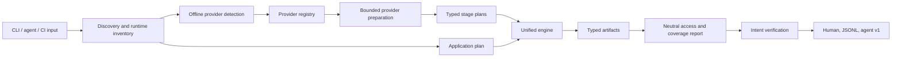

# Unruly architecture

Unruly has one execution architecture for application routes and every
supported *base backend. The command parses input and renders output; discovery
acquires facts; providers identify and plan; the engine validates, authorizes,
executes and finalizes one report.



## Ownership boundaries

| Layer | Owns | Must not own |
|---|---|---|
| `cmd/unruly` | flags, files, environment adaptation, terminal and file rendering | backend stages, provider preparation, intent comparison, coverage truth |
| `internal/discover` | fetching application HTML/assets and extracting identity facts | executing a backend or application assessment |
| `internal/provider` | offline detection, endpoint identity, exhaustive capability declarations, bounded preparation, provider stage construction | report rendering or command flags |
| `backend/*` | protocol-specific probes and typed intermediate artifacts | global orchestration, independent transports, exit codes |
| `backend/application` | provider-neutral application checks | assumptions about the database behind the application |
| `internal/engine` | validation, consent, one execution path, traffic attribution, access/coverage merge, interruption, intent and report finalization | provider-specific artifact types or presentation |
| `scan` | stage, descriptor, consent, budget and typed-artifact primitives | any backend vocabulary |

The executable contains one `engine.Run` call per target. A backend found in a
bundle and the same backend named directly therefore receive identical
validation, consent, transport, accounting and report semantics.

## Target lifecycle

1. Validate flags and the static plan shape before network traffic.
2. Acquire the application surface once. Every detector observes the same
   bytes; detectors never fetch.
3. Deduplicate detections by provider and project identity.
4. Build one application workload plus one workload per detected provider.
5. Run optional provider preparation. Preparation declares its consent class
   and a positive maximum request count; exceeding it stops that workload and
   becomes a coverage finding. Supabase uses this to resolve its PostgREST
   mount and acquire OpenAPI names in at most three requests.
6. Validate every stage graph and its configured consent requirements.
7. Execute each workload independently. A failed workload cannot discard a
   sibling's findings, and a duplicate workload is refused before a second
   probe.
8. Exchange stage results through typed artifacts. Runtime reads and writes
   must match the descriptor; undeclared dependencies fail the workload.
9. Merge provider-neutral `scan.Access`, `scan.Coverage` and
   `scan.ApplicationCoverage`, with attributed request spending.
10. Verify optional access intent, qualify all blind findings if interrupted,
    sort, deduplicate, and compute highest severity and incomplete coverage.
11. Render the finalized report. Renderers do not decide security truth.

## Provider contract

Every registered provider implements detection, a complete capability
manifest and staged planning. There is no alternate `Assess` registry path.

```go
type Detector interface {
    Limited
    Staged
    Name() string
    Detect(Surface) (Detection, bool)
}

type Staged interface {
    Stages(Detection, scan.Inputs) []scan.Stage
}
```

Optional endpoint and preparation interfaces remain provider-owned. Every
runnable stage implements `scan.Describer`; artifact identities are derived
from their Go types with `scan.ArtifactOf[T]()`.

## Coverage by surface

| Surface | Current effective coverage | Explicit limits |
|---|---|---|
| Application | static bundles, OpenAPI, exact allowed origins, HAR runtime routes, GET authorization consistency, bypasses, two-principal IDOR, consented POST | dynamic routes absent from all inventories remain unknown |
| Supabase | REST/RLS, schemas, RPC, auth/signup escalation, storage, GraphQL parity, Realtime, Edge Functions, history/previews | destructive/callable checks require explicit write/invoke consent |
| Firebase | Firestore and RTDB read/write, signup escalation, Storage, Remote Config, Cloud Functions, Realtime | Firestore collection enumeration is not publicly decidable; candidate coverage is a lower bound |
| Neon | credential reachability, hint-based relation discovery, authenticated read escalation and consented writes | an unauthenticated Data API request is non-discriminating; object storage/realtime are outside this product surface |
| PocketBase | anonymous collection reads and consented signup escalation | collection listing is superuser-only; file delivery, hooks, realtime delivery and anonymous writes remain explicitly unmeasured |

Limits appear as findings and drive the incomplete-coverage exit contract; they
are never converted into zero findings or claims that a surface is protected.

## Safety and scope invariants

- One shared client carries timeout, retry, limiter, circuit breaker and
  counters. Providers receiving no shared transport are stopped rather than
  allowed to improvise one.
- Detection is offline. A string found in a bundle is evidence, not authority
  to scan another origin.
- The page origin is in scope. Every cross-origin application backend requires
  an exact `-allow-origin`, including URLs imported from HAR.
- POST, account creation, database writes and code invocation are separate,
  visible consent decisions. `-no-residue` disables Neon writes because an
  accepted INSERT cannot be guaranteed removable.
- Samples are optional and redacted at collection time. Agent v1 never carries
  samples or response bodies and strips credentials and request bodies from
  replay commands.
- Attempted requests, circuit-refused work and planned candidates are different
  counters. Reports use what actually reached the transport.

## Evaluation architecture

The suite layers cheap structural checks before expensive realism:

1. package unit tests and artifact/consent contracts;
2. provider transcript and adversarial HTTP fixtures;
3. compiled-command reachability and architecture tests;
4. multi-provider application matrices and deterministic output checks;
5. mutation checks that must apply, compile and be killed by behavior tests;
6. optional authorized live labs for Supabase, Firebase, Neon and PocketBase.

The live layer proves vendor behavior; it does not substitute for offline
coverage. Every finding and every architectural invariant must remain testable
without credentials or internet access.

