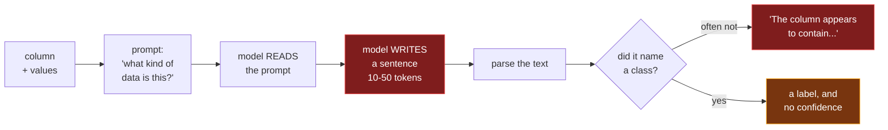
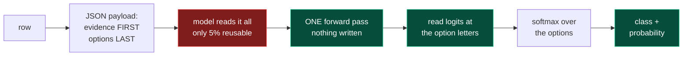
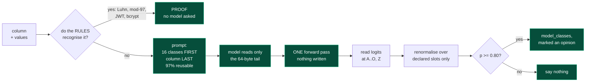
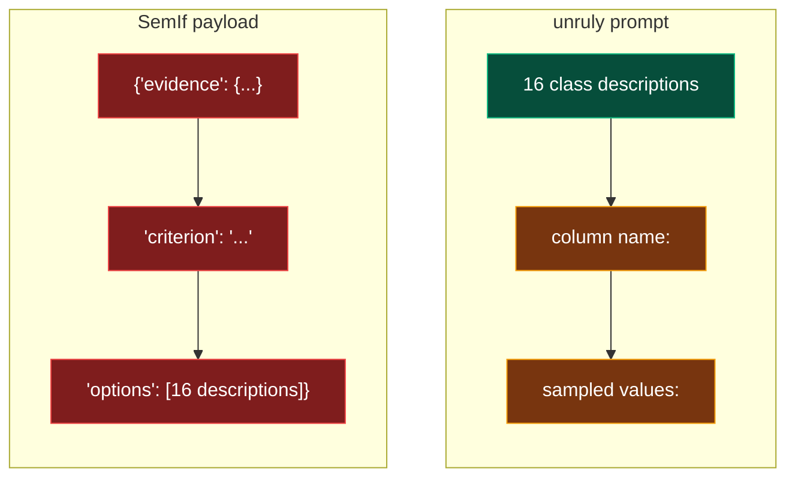

# Three ways to ask a model what a column holds

All three send a column name and some sampled values to a local model. What
separates them is **what they ask the model to produce** and **where they put
the part of the prompt that never changes**. Those two choices decide whether
you get a number you can gate on, and whether the scan takes ten minutes or
ten seconds.

Every figure below was measured on one laptop, with the prompt the scanner
actually sends.

**① The naive approach: ask, then read the answer.**



**② SemIf: the right readout, behind the wrong field order.**



**③ unruly: rules first, then the same readout with the blocks the other way round.**



## Why generating an answer is the expensive mistake

A real response from Ollama, for one column:

```
prompt_eval_count      423 tokens     prompt_eval_duration   358 ms
eval_count               1 token      eval_duration            0 ms
```

**Reading the prompt is the entire cost. Writing the answer is free.** So the
naive approach pays for the same prompt AND for 10 to 50 generated tokens, to
end up with a string instead of a number.

It also has no gate. Two measured failures that a probability would have
caught:

- Asked in prose, the top token for `national_id` was **"The"**. The correct
  class ranked second and renormalised to 0.649, below the 0.80 gate. A parser
  reading text would have taken the sentence at face value.
- With a reasoning model, the first token was **"Thinking"**. Recall 5.3%,
  false positives 96.2%. The answer was never at the position being read.

Reading logits at the answer slot avoids both. You get a distribution, so you
can decline.

## Why field order decides the speed

A prefix cache matches from the start of the prompt and stops at the first
byte that differs. Whatever sits after that has to be re-read, every row.



Green is reused between rows. Red has to be re-read.

SemIf puts the per-row evidence first, so its prompt starts differing at byte
25. Everything after it, including the option block it repeats word for word on
every row, is re-read. Measured on two consecutive rows:

| | shared between consecutive requests |
|---|---|
| SemIf | 25 of 550 bytes, **5%** |
| unruly | 1,810 of 1,874 bytes, **97%** |

That is the whole reason SemIf's prefix-reusing mode measured 484 ms per case
against 508 ms for a cold call, a gain of 5%. Its shared content is real. It
just sits behind the one field that always changes.

## Side by side

| | ① naive | ② SemIf | ③ unruly |
|---|---|---|---|
| tokens generated | 10 to 50 | 1 | 1 |
| output | a string | class + probability | class + probability |
| can it decline? | no | yes | yes, gate at 0.80 |
| deterministic | only if sampling is off | yes | yes |
| reusable prompt prefix | varies | **5%** | **97%** |
| rules consulted first | no | no | **yes, and they win** |
| measured per column | slowest | 484 ms | 340 ms Ollama, **15 ms llama.cpp** |

## The part that is not about speed

unruly asks the model **last**, and only about columns the rules could not
read. The rules are structural: Luhn plus an issuer length, IBAN mod-97, a JWT
header that base64-decodes, bcrypt's `$2b$` prefix at 53 characters. They
measure 0.4% false positives across 500 ordinary columns. The best model tested
measures 16%.

So a card number in a column called `notizen` is caught by Luhn, as proof, with
no model involved. When the model was asked about that same column it answered
`credential` at p=0.439, which is wrong, and the gate threw it away. When it
was asked about `bestellnummer`, an order reference, it answered `financial` at
p=0.757, also wrong, also discarded.

That is what the gate is for, and it is why anything the model does find lands
in a separate `model_classes` field. An opinion is not a proof, and the report
should not pretend otherwise.
