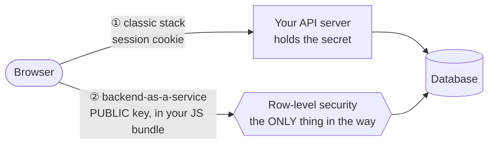
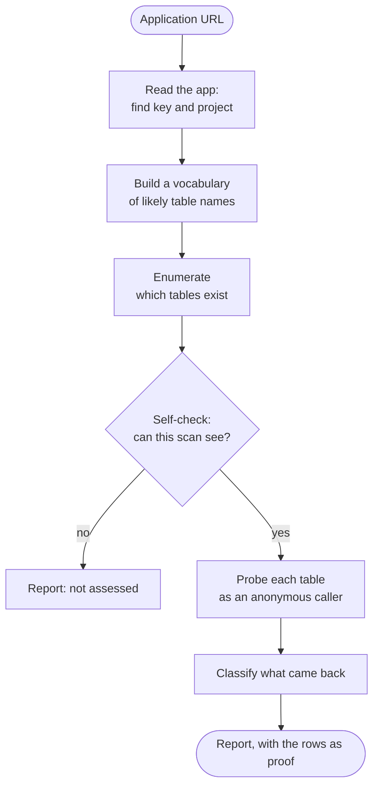
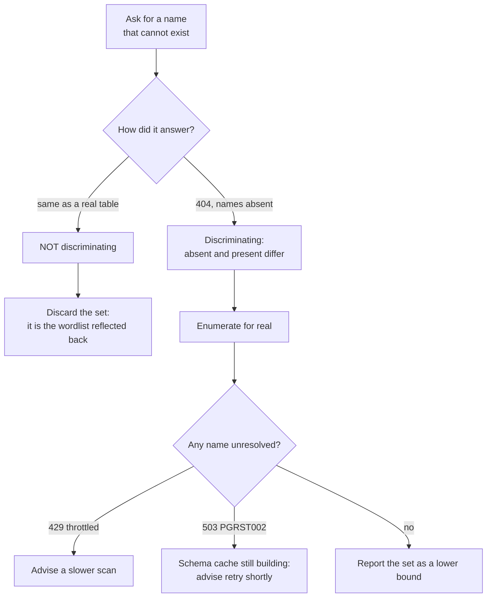
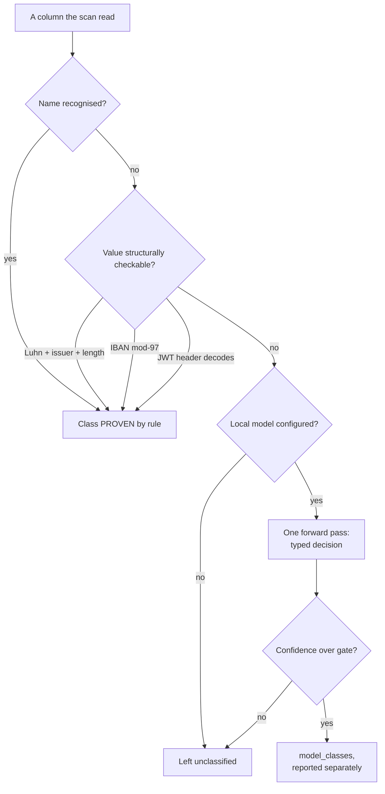
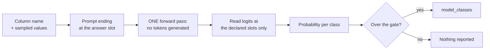

# How unruly works

Two levels. The first is for somebody deciding whether this belongs in their
programme; the second is for somebody who has to trust the result.

## Level 1 — why this is a different risk class

A classic stack keeps the database unreachable from the internet. The browser
talks to your API server, the server holds the secret, and a bug in your
authorization code exposes one endpoint.

A backend-as-a-service removes the server. The browser talks to the database
**directly**, using a key that ships in your JavaScript — by design, for
everyone, including anyone reading your bundle. Authorization moves out of code
you review and into row-level security policies on each table.

Both paths end at the same data. Miss one policy, or write one that is slightly
too permissive, and that table is a public API — card numbers, password hashes,
home addresses, one `curl` away with no login.

You will not find this by reading your code. You find it by asking the deployed
system.

## Level 1 — what one scan does

Every finding carries the evidence that produced it: the request, the status,
and real rows the server returned. A finding without retrievable proof is
reported as a different thing, not as a leak.

The scan also signs up as two separate users and compares what each receives. A
policy that grants access to the *role* rather than to the *owning user* looks
correct in review and leaks every row to anyone who can register.

## Level 1 — what the exit code means

| Exit | Meaning |
|---|---|
| 0 | Nothing found, and every surface was assessable |
| 2 | At least one finding at high or critical |
| 3 | Nothing high or above, but some surface could not be assessed — **not a clean result** |

Exit 3 is the one worth insisting on. A scanner that reports "no findings"
after failing to reach the database is lying by omission.

**What it will not do.** It is not a pentest: it covers one class of failure,
what an anonymous or freshly registered caller reaches through the backend's
own API. It does not replace your platform's advisor — run both. It sends real
requests, so it is for systems you own or are explicitly authorised to test.
Write probes are off unless you pass a flag naming you as the owner.

## Level 2 — enumeration

The database will not list its tables. So the scan asks about names and watches
how the server answers.

Four seed sources, in descending order of how much they tell you about *this*
target:

| Source | Where it comes from |
|---|---|
| Advertised | The OpenAPI document PostgREST serves — names the project declares |
| Harvested | Vocabulary read out of the application's own JavaScript |
| Supplied | Names an operator or agent passed in |
| Pinned | A fixed list of 872 conventional names, identical for every target |

Only the last is guesswork, and it is a weak generator on its own: of 92
relation names across the benchmark corpus, 15 appear in the pinned list. Real
schemas use compound, domain-specific, often non-English names. What rescues it
is the **near-miss expansion** — when a direct guess lands, the scan mutates
around the hit, which is how `news` becomes `news_items`, `news_images`,
`news_categories`.

Measured on the reference project: ref and key alone recovers 21 of 21
relations in 19,059 requests, of which 15,180 are that expansion. Given the
application as well, the same 21 in 11,754 requests — the extra vocabulary buys
the same answer for 38% of the traffic.

**The hint oracle.** PostgREST does not just say no. Ask for a table that does
not exist and it volunteers what it *does* have, in the error body. That is
direct evidence the oracle works against this target, which a synthetic probe
cannot establish: a probe that draws no hint may simply have been unlike
anything in the schema.

**The control relation is the load-bearing part.** Before trusting anything the
enumeration did *not* find, the scan asks for a name that cannot exist. If the
target answers that identically to a real table, absent and present are
indistinguishable, every conclusion collapses, and the enumerated set is
discarded rather than reported.

**Unresolved names are split by cause, because the two remedies are
opposites.** A throttling host wants a slower scan. A host answering `503
PGRST002` is still building its schema cache after a deploy and wants the same
scan a minute later — lowering the rate limit does nothing. Measured in the
corpus: a key verified warm passed; the same key cold failed 23 of 35 claims.
Same target, same credential, seconds of uptime between them.

## Level 2 — the self-check

"No findings" from a blind scan is the exact lie this tool exists to avoid. So
before anything trusts what the scan did *not* find, the scan tests its own
instruments against cases whose answers are known by construction.

Where an oracle cannot be shown to work, the surface it covers is reported as
`unruly-surface-not-assessed`, by name, rather than counted as clean. That is
not noise — it is the scan declining to claim a result it did not earn, and it
is what makes the absence of a finding mean something.

## Level 2 — data classification

"`payment_methods` is readable" and "`payment_methods` is readable and contains
card numbers" are different incidents, and only one wakes somebody up. Three
classifiers answer that, in a strict order of authority.

**By column name.** Cheap — needs no rows retrieved, which matters when
retrieving them means copying somebody's data to prove a point the names
already prove. It is English-only, and that is a real limit.

**By sampled value.** Language-independent, and it catches the sensitive thing
inside a generic column — including a JSONB field holding `{"card": "4111..."}`,
a shape no name rule can see. Every rule is structural rather than statistical:
a card number must pass Luhn **and** carry a real issuer prefix **and** be a
length that issuer uses. Rules that cannot be checked that way are left out,
however tempting — a US SSN has no checksum, so nine digits anywhere would tag
as a government identifier.

**By local model — optional, off by default.** The rules prove rather than
guess, which is why they work in any language without reading a column name. It
is also why they are blind to a street address or a diagnosis: that text
carries nothing checkable.

Three guarantees, each held by a test rather than by care:

1. A column the rules classified is **never sent to the model** — not preferred
   over, not compared against, never asked.
2. A class arrives only above `-classifier-threshold`, default 80.
3. It lands in a separate `model_classes` field and prints marked `(model?)`.
   An opinion is not a proof.

Measured on 550 columns across 22 data classes and 25 languages:

| | Recall | False positives |
|---|---|---|
| Rules alone | 14.9% | 0.4% |
| Rules + a local 4B model | 88.0% | 16.4% |

That 16% is why model classes do **not** raise severity. Severity drives exit
codes and pipeline gates; a signal that wrong escalating a finding is how a
severity column stops being believed.

### Why a typed decision, not a chat model

The model is never asked to write anything. Each class owns a single-token
answer slot, the prompt ends exactly where the answer belongs, one forward pass
runs, and the probabilities are read off the logits at that one position and
renormalised over the declared slots.

This buys three things a generate-and-parse classifier cannot:

- **Speed.** No answer sentence is produced. 340 ms median per column against a
  local 4B model.
- **Determinism.** One token, temperature zero, no sampling. Two runs produce
  identical output, which is a published property of this scanner.
- **A number to gate on.** A generated answer gives you a string. This gives a
  probability, and the gate is the only thing between a useful classifier and a
  16% false-positive rate landing in a report.

It runs on your own hardware — llama.cpp, Ollama, LM Studio or vLLM, discovered
on loopback. Nothing about your database leaves the machine. Two settings are
load-bearing and sent automatically: reasoning is switched off, because a
reasoning model emits a thinking block where the answer should be; and the
prompt demands a bare letter, because otherwise the model starts a sentence and
the correct answer ranks second.

## Accuracy, and what is not claimed

Graded end to end against a corpus of sixteen projects whose answer keys were
established by direct measurement against a running stack — not by reading the
schema, and not by running the scanner and writing down what it said.

| Dimension | Recall | Precision | n |
|---|---|---|---|
| Relation discovery | 91.1% | 100% | 101 |
| Read exposure | 89.5% | 100% | 57 |
| Protected, not flagged | 100% | 100% | 43 |
| Write exposure | 100% | 100% | 6 |
| Data classification | 100% | 100% | 9 |

**Recall is quoted beside precision deliberately.** A precision number without
its recall companion is marketing. Precision is held down by controls, not
luck: five negative controls run in every batch — hosts that are *not* Supabase,
including one answering `200` to any path — where the correct result is silence.

**A relation with no class named is not a relation known to be harmless.** It is
one where no rule matched. Recall is a lower bound everywhere, and the tool says
so rather than implying completeness.

A false negative is treated as a vulnerability in this project, not as a
missing feature. The not-assessed signal, the control relation and the
self-check all exist to make silence mean something — because a scanner whose
silence cannot be trusted is worse than no scanner at all.
